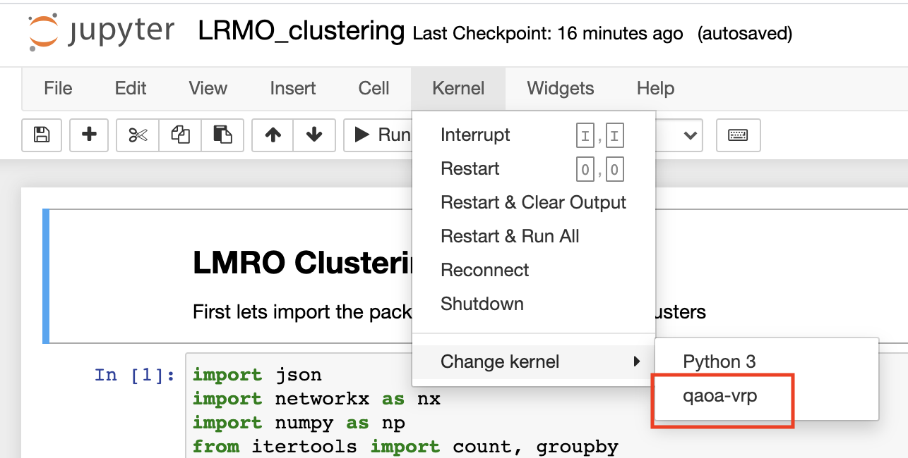

# HAQC -- Heuristic Algorithms for Quantum Computing Research Group [](https://travis-ci.com/vivekkatial/HAQC)

Research group to run optimisation algorithms on Quantum Computers at the University of Melbourne

## Getting Started

Before getting started, ensure you have Python 3.7+. We use [pipenv](https://pipenv-fork.readthedocs.io/en/latest/) to manage the python environment (the .gitignore file should already ignore it).

```{shell}
$ pipenv install
```

To add a package to your new project:

```{shell}
$ pipenv install <package>
```

This will automatically edit your pipfile with the new package you provided.

Next, activate the Pipenv shell:

```{shell}
$ pipenv shell
$ python --version
```

This will spawn a new shell subprocess, which can be deactivated by using exit.

## Testing


## MLFlow Tracking

To get the MLFlow tracking functionality to work you will need to setup `awscli` credentials, so MLFlow can properly log artifacts.

If you're keen to do this then please follow the instructions [here](https://wiki-rcs.unimelb.edu.au/display/RCS/AWS+CLI)

You can request the credentials for this experiment from Vivek at vkatial@student.unimelb.edu.au

## Running a test instance

To run a test instance try out the steps below:

```bash
python qaoa_vrp/main.py -f test -T False # -T tracking for MLFlow
```

### Jupyter Notebooks

First ensure that your Python is _not_ aliased in your `.bashrc` or `.zshrc` file.

After this launch your `pipenv` by

```{shell}
pipenv shell
```

Then do:

```{shell}
python -m ipykernel install --user --name=qaoa-vrp
```

Then launch the notebook

```{shell}
jupyter notebook
```

In your notebook, Kernel -> Change Kernel. Your kernel should now be an option.


